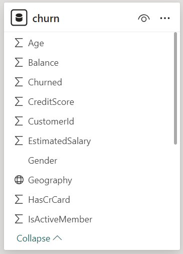

#  📊 Unveiling the Churn Enigma: Retaining Customers Through Data-Driven Insights
## A Bank-Customer-Churn-Analysis

In the dynamic world of finance, customer retention is paramount. 
This comprehensive churn analysis delves deep into the intricate patterns that drive customer attrition, 
empowering banks and financial institutions to proactively address this critical challenge.
## INTRO

### Table View
 

### Power Query
 

### Model

 

## Key Findings: 

                

- 🔍 _Demographic Dynamics:_ Age and geographic location significantly influence churn patterns, presenting opportunities for targeted strategies.
  
:                                                                         

- 💰 _Behavioral Blueprints:_ Factors like credit score, tenure, balance, and number of products held emerge as strong predictors of churn risks. 

- 📅 _Temporal Tapestries:_ Seasonal fluctuations and cyclical trends shape the churn landscape, enabling anticipation and mitigation during high-risk periods.

:                           : 

## Actionable Recommendations: 

- 🎯 __Demographic Tailoring:__ Develop customized retention strategies for specific age groups and regions, addressing unique needs and preferences.

- 📈 __Behavioral Monitoring:__ Implement robust systems to track customer behavior patterns, enabling early detection and prompt interventions. 

- ⌛ __Temporal Adaptability:__ Deploy retention campaigns and incentives during identified high-risk periods, mitigating the impact on revenue.

By embracing these data-driven insights and recommendations, financial institutions can forge enduring customer relationships, ensuring long-term growth and sustained competitive advantage in the ever-evolving financial landscape.

### APPENDIXES:

:                                    

